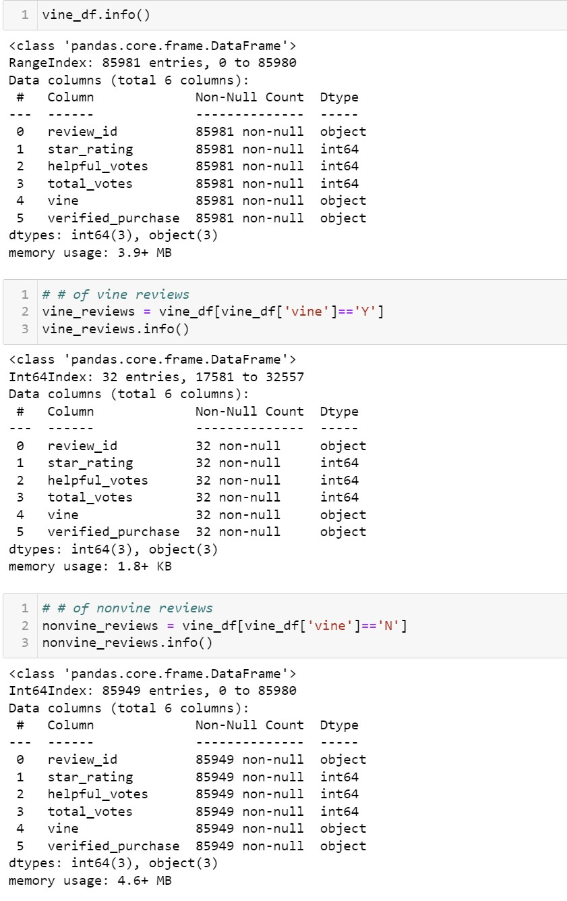
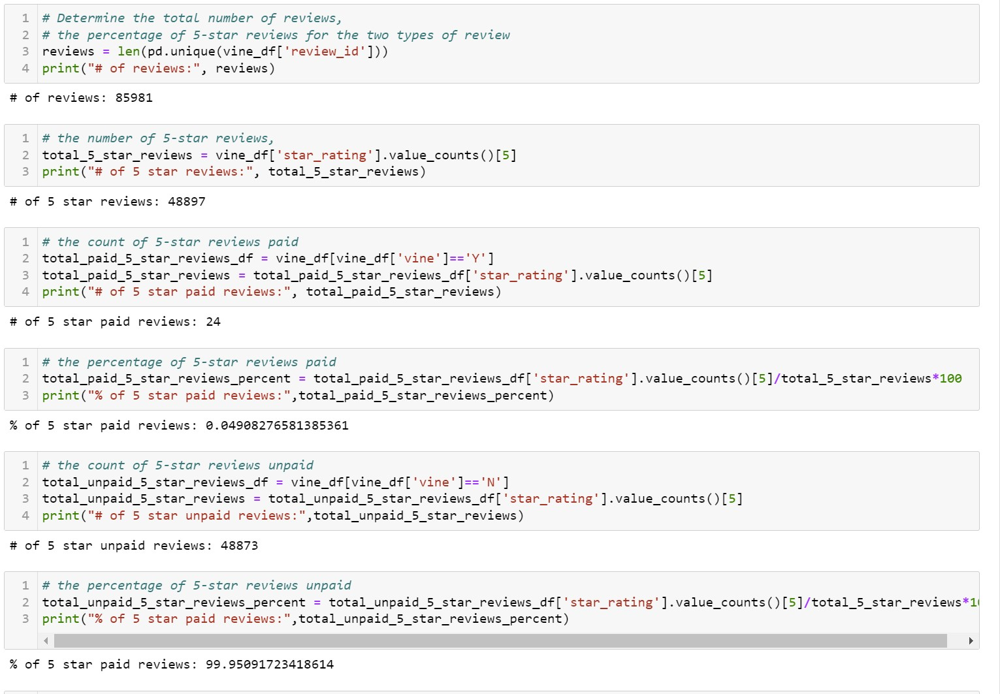

# ChallengeModule_17-Big-Data

ChallengeModule_17-Big-Data

## Overview

The project is designed to retrieve data from AWS, load the data into a database then, parse the data down so that it can be further examined.  In this instance the further examination is to determine whether or not if there is any bias toward favorable reviews from Vine members in your dataset. The project involves creating (and subsequently deleting) an AWS RDS database that is linked to PostgreSQL and pgAdmin.  Personal Appliance Data will be taken into SQL and then Pandas will be used to further examine the dataset.

## Analysis

### Quick Overview of the Data Set

In this data set the number of Vine reviews is smaller than expected.  The total data set has 85981 records with 32 Vine reviews and 85949 nonvine reviews.  The data set includes 48897 5 star reviews and 3414 reviews that have received over 20 votes.

### Results

Overall 99.95% of the total count of 5 star reviews were from nonvine reviews, leaving 0.05 (rounded up) of 5 Star reviews (Image Below).  At first glance this number would seem to indicate that paying Vine members to review products is not worth the cost.  However, 24 out of the 32 or 75% of the vine reviews were 5 Star.  Conversely, unpaid 5 Star review total was 48873 out of 85949 or 52.20%.

## Summary

The small number of Vine reviews in this data set make it difficult to make any predictions with certainty.  However, the percentage of 5 Star reviews compared to the total reviews would suggest that more exploration is needed before deciding whether to proceed with engagement in the Vine Program.   75% of 5 Star review is a significant number of perfect reviews and would lean toward a bias of paid reviewers being more favorable.  However, given the small percentage of paid reviews compared to the total revies, the results of the Vine program would not be affecting the overall star rating.  The following recommendations should be looked into before any final decision is made.

* What is the cost of each Vine review & is it feasible to increase the number of Vine reviews to alter the star rating?
* If the number of Vine reviewers is increased does the 75% 5 Star rating benchmark hold? Increase? Decrease?
* What is the overall rating of the product? Could the Vine reviewer resources be better used to satisfy people who reviewed the product unfavorably, and increase the ratings by removing low stars instead of adding high star reviews?
